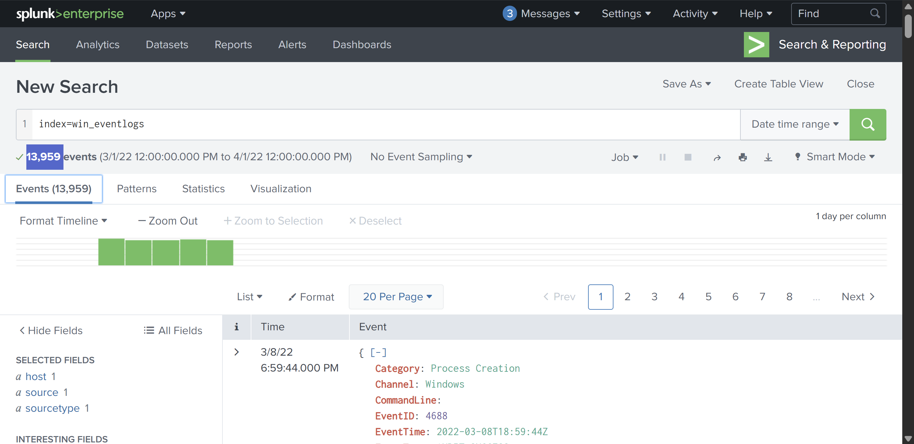

# Benign

# Scenario

One of the client’s IDS indicated a potentially suspicious process execution, indicating that one of the hosts from the HR department was compromised. Some tools related to network information gathering / scheduled tasks were executed which confirmed the suspicion. Due to limited resources, we could only pull the process execution logs with Event ID: 4688 and ingested them into Splunk with the index **win_eventlogs** for further investigation.

# About the Network Information

The network is divided into three logical segments. This will help in the investigation.

**IT Department**

- James
- Moin
- Katrina

**HR Department **

- Haroon
- Chris
- Diana

**Marketing Department **

- Bell
- Amelia
- Deepak

---

### How many logs are ingested from the month of March, 2022?

I set the Date time range and used the **`index=win_eventlogs`** SPL query and got the answer to this question.



### Imposter Alert: There seems to be an imposter account observed in the logs, what is the name of that user?

I ran a SPL query to display all usernames and identified an imposter account mimicking someone through typosquatting.

```bash
index="win_eventlogs" 
| table UserName
| dedup UserName
```


### Which user from the HR department was observed to be running scheduled tasks?

To identify which user ran a scheduled task, I used the following SPL query, shown in the screenshot.


### Which user from the HR department executed a system process (LOLBIN) to download a payload from a file-sharing host.

I searched on Google about `lolbins,` and I found that it is a legitimate Windows binary that attackers use to avoid detection.


We already know the HR department personnel, and from the search, I found that **`certutil`** with **`urlcache`** parameter is commonly used by the attacker to download payloads.

So, I used the following query and got the answer.


### To bypass the security controls, which system process (lolbin) was used to download a payload from the internet?

From the previous task, we already got the answer to this question.

### What was the date that this binary was executed by the infected host? format (YYYY-MM-DD)

### Which third-party site was accessed to download the malicious payload?

### What is the name of the file that was saved on the host machine from the C2 server during the post-exploitation phase?

### What is the URL that the infected host connected to?

From the details of the previous event, I got the answers to all of the above questions.


### The suspicious file downloaded from the C2 server contained malicious content with the pattern THM{..........}; what is that pattern?

I searched the URL into the browser and got the content of the file.


