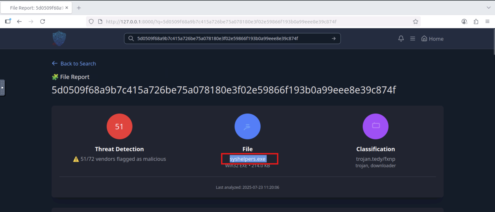

# Invite Only

You are an SOC analyst on the SOC team at Managed Server Provider TrySecureMe. Today, you are supporting an L3 analyst in investigating flagged IPs, hashes, URLs, or domains as part of IR activities. One of the L1 analysts flagged two suspicious findings early in the morning and escalated them. Your task is to analyse these findings further and distil the information into usable threat intelligence.

Flagged IP:**`101[.]99[.]76[.]120`**

Flagged SHA256 hash: **`5d0509f68a9b7c415a726be75a078180e3f02e59866f193b0a99eee8e39c874f`**

This is the TryHackMe SOC challenge. Whatever I have learned about threat intelligence so far, I will use that knowledge to solve this room.

### 1. What is the name of the file identified by the flagged SHA256 hash?

To solve this question, I used the TryDetectMe tool. I pasted the SHA256 hash and got the file name.

### 2. What is the file type associated with the flagged SHA256 hash?

To find out the file type, I clicked on the Details tab, scrolled a little bit and found it.

### 3. What are the execution parents of the flagged hash?

To see the execution parents, I clicked on the Relations tab and found them.

### 4. What is the name of the file being dropped?

To see what file the malware creates after being executed, I clicked on the Behaviour tab and found it.

### 5. Research the second hash in question 3 and list the four malicious dropped files in the order they appear.

The hash we got in question 3:

1. 361GJX7J: `047c5eec0445746862710d20e50a5dd04510b7e625fa5c1f5d48ce078001c0de`
2. Installer.exe: `fa102d4e3cfbe85f5189da70a52c1d266925f3efd122091cdc8fe0fc39033942`

Now I have been told to analyse the Installer.exe hash. For that, I pasted the hash into the `VirusTotal` tool and, in the Relations tab found the dropped files.

### 6. Analyse the files related to the flagged IP. What is the malware family that links these files?

I searched for the IP using the tool and clicked on the Relations Tab. In this tab, I saw a section called Communicating files. Then I clicked on the Community tab and searched for the comments that are associated with the IP and got the malware family name.

### 7. What is the title of the original report where these flagged indicators are mentioned? Use Google to find the report.

I used Google to find the original report on this and got the title.

### 8. Which tool did the attackers use to steal cookies from the Google Chrome browser?

### 9.Which phishing technique did the attackers use? Use the report to answer the question.

### 10. Which phishing technique did the attackers use? Use the report to answer the question.

I just read a report, and in the key takeaway section, I found the answers to all the questions.

