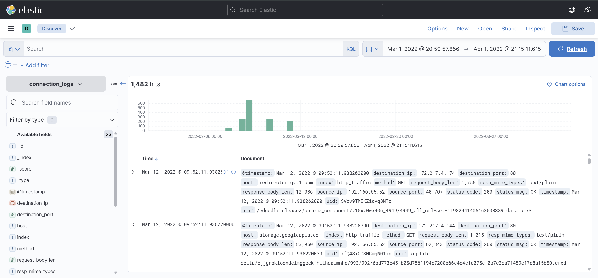

# ItsyBitsy

# Scenario

During normal SOC monitoring, Analyst **John** observed an alert on an IDS solution indicating a potential C2 communication from a user, **Browne** from the HR department. A suspicious file was accessed containing a malicious pattern THM:{ ________ }. A week-long HTTP connection logs have been pulled to investigate. Due to limited resources, only the connection logs could be pulled out and are ingested into the `connection_logs` index in Kibana.

Our task in this room will be to examine the network connection logs of this user, find the link and the content of the file, and answer the questions.

---

### 1. How many events were returned for the month of March 2022?

First, I set the time range from 1 March 2022 to 1 April 2022. Then In screen shot we can see that we have 1428 hits.

### 2. What is the IP associated with the suspected user in the logs?

To find the IP, I just checked the `source_ip` filter, and I got the IP.

### 3. The user’s machine used a legit windows binary to download a file from the C2 server. What is the name of the binary?

### 4. The infected machine connected with a famous file-sharing site during this period, which also acts as a C2 server used by the malware authors to communicate. What is the name of the file-sharing site?

### 5. What is the full URL of the C2 to which the infected host is connected?

I applied the malicious source IP as a filter and got 2 hits. I then added the columns host, url, user_agent, method and status_code to analyse better and got the answers to all the 3 questions above.

Like the Windows binary is the user agent, the famous file-sharing platform `Pastebin` and the complete URL of the C2 to which the infected host is connected.

### 6. A file was accessed on the file-sharing site. What is the name of the file accessed?

### 7. The file contains a secret code with the format THM{_____}.

The file-sharing site is legit, so anyone can visit it. I entered the URL into the browser, and I got the result with the file name and its content.

