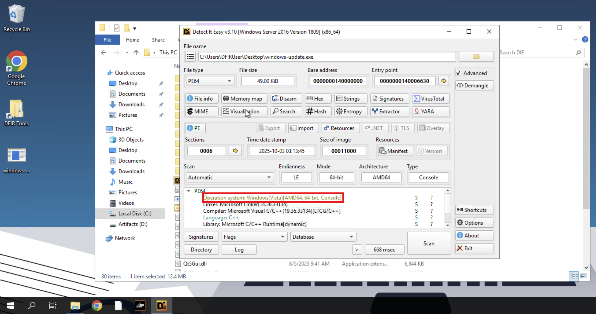
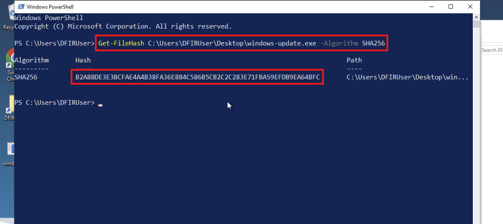
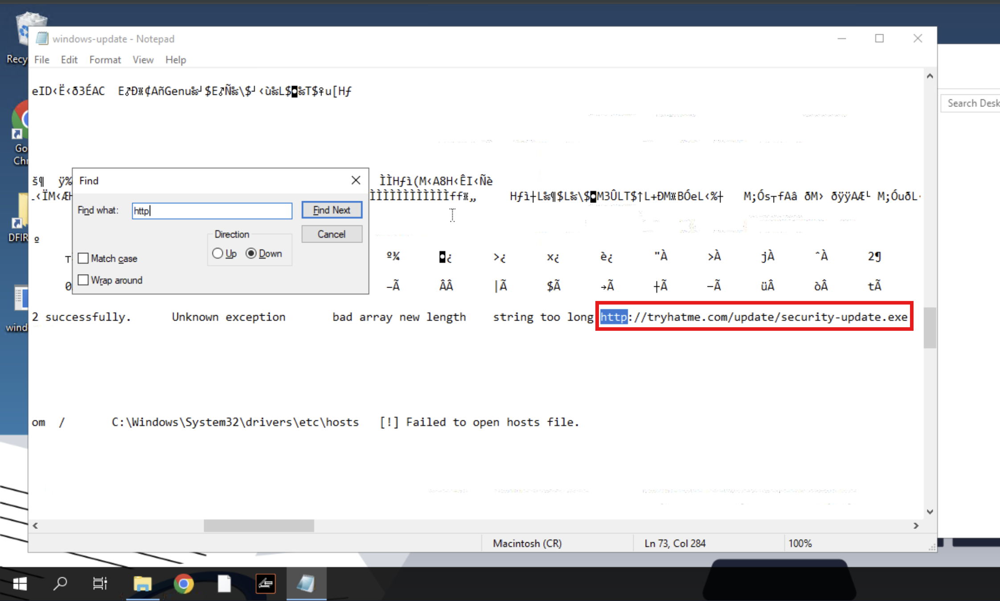

# **TryHackMe: Shadow Trace – Room Walkthrough**

## **Scenario**

It’s the middle of the night shift. You’re the only analyst in the SOC when a manager calls in urgently: a suspicious file was found on a user's machine and needs immediate review.

You open the file and start digging. Something doesn’t look normal for a company updater, and at the same time, the EDR throws a couple of alerts.

Your task: analyse the file, collect anything to identify it, gather any potential IOCs, correlate and analyse the alerts for potential malicious behaviour. It’s up to you to piece together what’s happening before it spreads further.

## **File Analysis**

### **1. Binary Architecture Determination**

To determine the binary’s architecture, I used the **DIE (Detect It Easy)** tool. The file has a 64-bit architecture.



### **2. Calculating SHA256 Hash**

I used PowerShell to create a SHA256 hash of the file.

```
Get-FileHash C:\Users\DFIRUser\Desktop\windows-update.exe -Algorithm SHA256
```



### **3. Static String & URL Extraction**

To find the hidden URL in the file through static analysis, I used Notepad to open it and search for a URL.



Again, I used the search function in Notepad and found a domain that can be used as an IOC.


### **4. Decoding Base64 String**

From the suspicious domain, I found the Base64-encoded string.


I decoded it using CyberChef and got the flag.


### **5. Analysing Loaded PE Imports**

I used the **PE-bear** tool to find the library related to socket communication that is loaded by the binary (`WS2_32.dll`).


