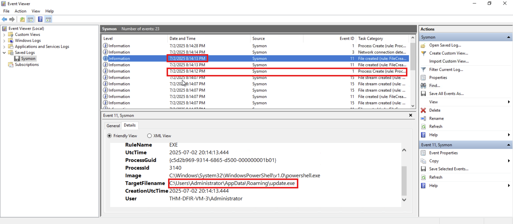

# **Windows Threat Detection 3**

## **Command and Control:**

I have the logs at: **`C:\Users\Administrator\Desktop\Practice\Task 2\Sysmon.evtx`**

1. To find out which suspicious archive the user downloaded:
    
    I opened the Sysmon logs and applied filter 11 to see the malicious archive downloaded by the user.
    
    
    
2. To find where the attackers hide the C2 malware file:
    
    I checked the logs after that one by one, and I got the malware file location.
    
    
    
3. To find the domain of the Command and Control server:
    
    I applied filter 22 to check the logs of DNS queries.
    
    
    

## **Persisting via RDP:**

```bash
# 1. Two methods to create the "mr.backd00r" user
CMD C:\> net user "mr.backd00r" "p@ssw0rd!" /add
PS  C:\> New-LocalUser "mr.backd00r" -Password [...]

# 2. Two methods to add the user to Administrators 
CMD C:\> net localgroup Administrators "mr.backd00r" /add
PS  C:\> Add-LocalGroupMember "Administrators" -Member "mr.backd00r"
```

## **Detecting Backdoored Users:**

I have the logs at: **`C:\Users\Administrator\Desktop\Practice\Task 3\Security.evtx`**

1. To find out how many times the threat actor failed to log in to the Administrator:
    
    I applied the filter with event ID 4625 for failed logon.
    
    
    
2. To find out, after the successful login, which backdoor user did the attacker create:
    
    After the successful login by the attacker, I checked the event ID 4720 for the user creation log.
    
    
    
3. To find out which privileged group the backdoor user was added to:
    
    I checked the logs with Event ID 4732 for a newly created user added to one of the privileged groups.
    
    
